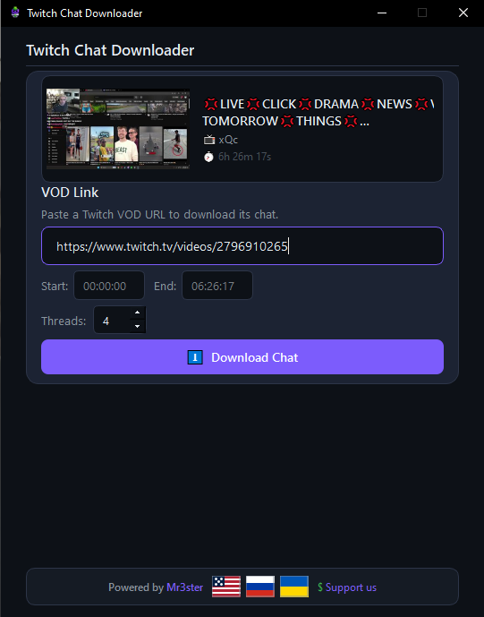

# Twitch Chat Downloader

> [🇷🇺 Русский](README.ru.md) · [🇺🇦 Українська](README.uk.md)

A fast desktop app **and** CLI tool to download chat messages from Twitch VODs. Export to TXT, CSV, or view directly in your browser.


<p align="center">
  
</p>

## ✨ Features

- **🚀 Blazing fast** — multi-threaded chat parsing scans different VOD segments in parallel
- **⚡ High performance** — up to 16 threads, significantly faster than single-threaded alternatives
- **🎯 Precise timing** — download chat for a specific time range (Start / End)
- **🖼️ Live preview** *(GUI)* — VOD thumbnail, title, channel, and duration displayed before download
- **📤 Three export formats** — TXT, CSV, or interactive browser view with search and filtering
- **🌍 Multi-language** *(GUI)* — English, Russian, Ukrainian (switch with flag icons)
- **🛑 Cancel anytime** — abort download with one click or Ctrl+C
- **⚙️ Adjustable threads** — tune thread count to match your connection
- **💻 CLI mode** — headless download, perfect for scripts and automation

## 📸 Screenshots

<p align="center">
  
</p>

<p align="center">
  
</p>

## 📦 Installation

### Requirements

- Windows 10 / 11, macOS, or Linux
- Python 3.10 or higher
- pip (Python package manager)

### Quick Start

```bash
# 1. Clone the repository
git clone https://github.com/ZetHor3/TwitchChatDownloader.git
cd twitch-chat-downloader

# 2. Install dependencies
pip install -r requirements.txt

# 3. Run (choose one)
python main.py     # Graphical interface
python cli.py ...  # Command line (see below)
```

Or just double-click `run.bat` — it installs dependencies and launches the GUI app automatically.

## 🎮 Usage

### GUI mode

1. **Paste a VOD URL** — e.g. `https://www.twitch.tv/videos/2796577649`
2. **Wait for the preview** — the app fetches thumbnail, title, channel and duration
3. **(Optional) Set time range** — Start and End fields to download only a portion of the chat
4. **Click Download Chat** — multi-threaded download begins
5. **Export the result** — TXT, CSV, or Browser (interactive HTML with search/filter)

### CLI mode

```bash
# Download entire chat to a TXT file
python cli.py https://www.twitch.tv/videos/2796577649

# Download a specific time range
python cli.py 2796577649 --start 10:00 --end 1:30:00 -o chat.txt

# Export as CSV with 8 threads
python cli.py 2796577649 -f csv -t 8

# Generate interactive HTML viewer and open in browser
python cli.py 2796577649 -f browser --open

# Quiet mode (no progress bar, for scripts/pipes)
python cli.py 2796577649 -q -f csv
```

#### CLI options

| Argument | Description |
|----------|-------------|
| `url` | Twitch VOD URL or numeric ID |
| `-o, --output` | Output file path (auto-generated from video info by default) |
| `-f, --format` | Output format: `txt` (default), `csv`, `browser`/`html` |
| `-t, --threads` | Number of threads (1–16, default: 4) |
| `--start` | Start time — `MM:SS` or `HH:MM:SS` |
| `--end` | End time — `MM:SS` or `HH:MM:SS` |
| `--open` | Open browser/HTML output in the default browser |
| `-q, --quiet` | Suppress progress bar, print only the final summary |

Press **Ctrl+C** at any time to cancel safely.

## 🧵 Thread Configuration

The `Threads` setting controls download speed:

| Threads | Speed | Network load |
|---------|-------|-------------|
| 1–2 | Low | Minimal |
| 4–6 | Medium | Recommended |
| 8–16 | High | For fast connections |

## 📁 Project Structure

```
twitch-chat-downloader/
├── main.py                # PyQt6 GUI application
├── cli.py                 # CLI application (headless)
├── chat_downloader.py     # Chat download engine (Twitch GQL)
├── worker.py              # Background download thread (GUI only)
├── l10n.py                # Localization (EN/RU/UK)
├── requirements.txt       # Dependencies
├── run.bat                # Windows quick launcher
├── assets/
│   ├── logo.png           # Application icon
│   └── flags/             # SVG flag files
└── README.md
```

## 🛠️ Technical Details

- **GUI**: PyQt6 with custom circular progress and flag rendering via QPainter
- **CLI**: Pure Python (argparse), zero GUI dependencies
- **API**: Twitch GQL (persisted query `VideoCommentsByOffsetOrCursor`)
- **Scanning**: segmented (30-second steps) to avoid cursor pagination blocks
- **Networking**: httpx, multi-threaded via `ThreadPoolExecutor`

## 📄 Export Formats

### TXT
```
[00:00] username1: Hello!
[00:05] username2: How are you?
[00:12] username1: I'm good
```

### CSV
```
Timestamp,TimeInVideo,Username,Login,Message
2024-01-01T00:00:00Z,00:00,username1,user1,Hello!
```

### Browser
Built-in HTML page with text search, username filtering, and sorting.

## 🌐 Localization *(GUI only)*

Switch language by clicking a flag icon in the bottom bar:
- 🇬🇧 **English**
- 🇷🇺 **Русский**
- 🇺🇦 **Українська**

## 📜 License

MIT License — feel free to use, modify, and distribute. Attribution appreciated.

## 👤 Author

**ZetHor3** — [GitHub](https://github.com/ZetHor3)

---

<p align="center">
  <sub>Built with Python, PyQt6 and ❤️</sub>
</p>
